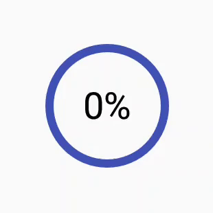

[](https://app.bitrise.io/app/d7ee707de84d8b4a)
[](https://jitpack.io/#tobiasschuerg/CircleProgress)


# CircleProgress

Circular progress *bar* for android - with text inside.



### Setup

```
<com.tobiasschuerg.progresscircle.ProgressCircleView
        android:id="@+id/progress"
        android:layout_width="wrap_content"
        android:layout_height="wrap_content"
        app:thickness="4dp"
        app:radius="60dp"
        app:textSize="18sp"
        android:layout_marginTop="8dp"/>
```

Optional: set custom text update function:
```
progress.getText = { progress: Int, max: Int, percentage: Float ->
    (progress / steps).toString() + "s"
}
```


### Get it

Step 1. Add the JitPack repository to your build file
Add it in your root build.gradle at the end of repositories:
```
allprojects {
		repositories {
			...
			maven { url 'https://jitpack.io' }
		}
	}
```
Step 2. Add the dependency
```
dependencies {
	  implementation 'com.github.tobiasschuerg:CircleProgress:Tag'
	}
```
